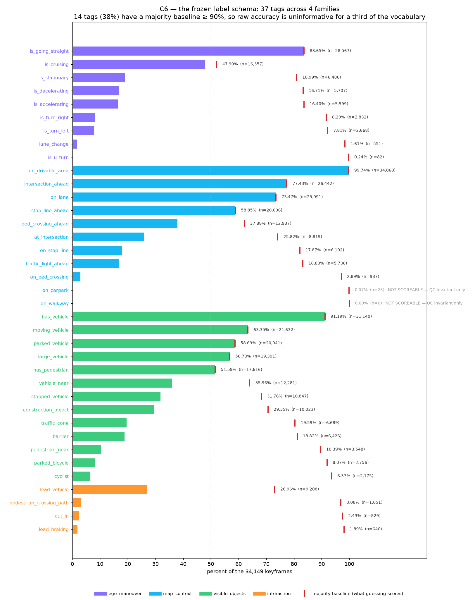
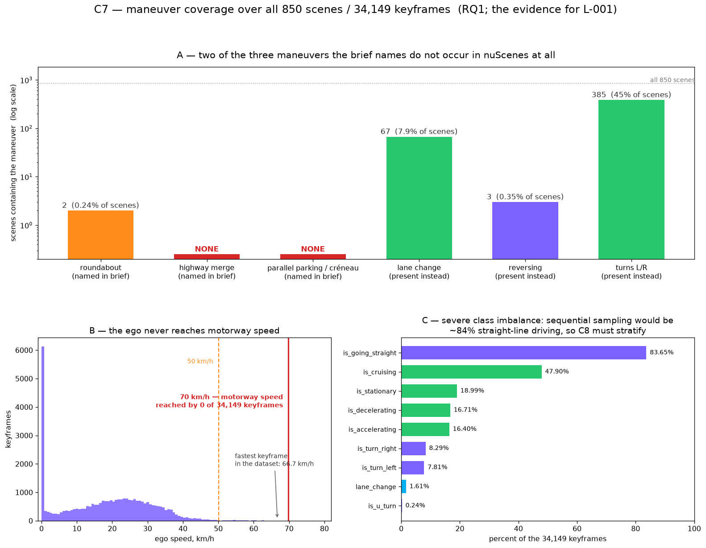
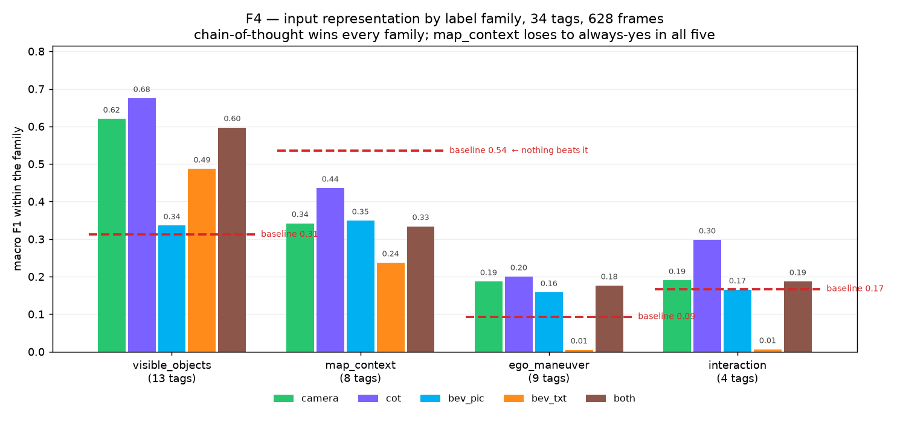
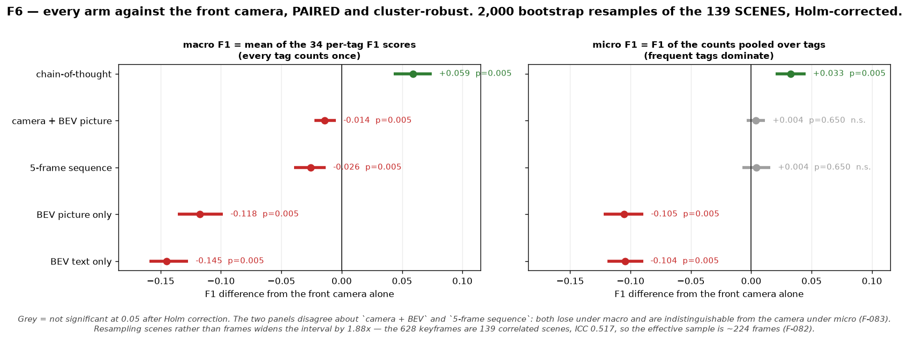
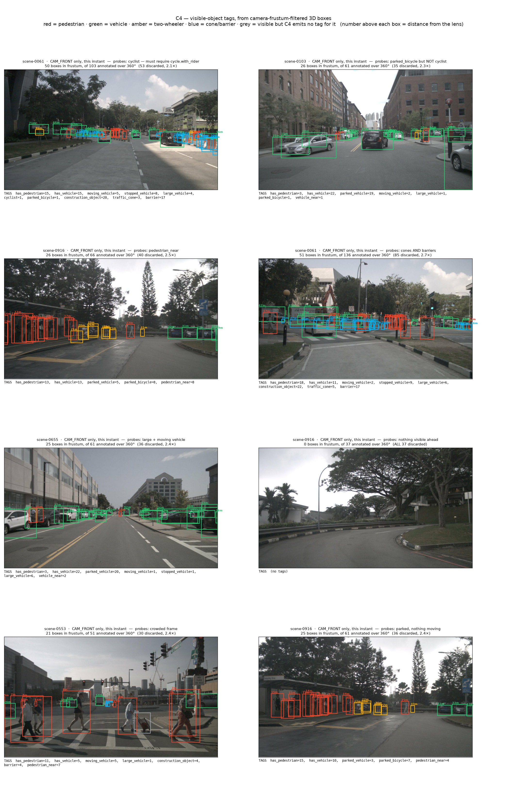
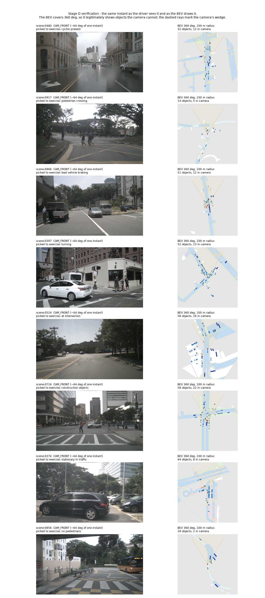
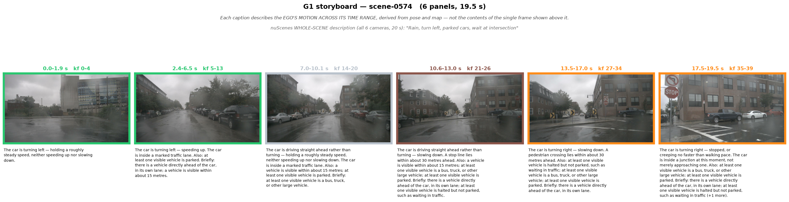
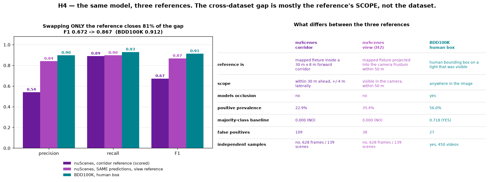

# Deterministic Scenario Mining as an Auditable Reference for Vision Language Model Auto Labelling on nuScenes

Code, result artifacts and figures for an MSc dissertation carried out at **IRT SystemX**
(SYNERGIES project, automated vehicle theme) for **ECE Paris**, MSc Artificial Intelligence.

**Author:** Ali Raza · **Host supervisor:** Yoann Randon, IRT SystemX · September 2026

---

## What this is

Manual annotation is the acknowledged bottleneck in building the scenario databases used to
validate automated vehicles, and vision language models (VLMs) are increasingly proposed as
its replacement. Judging that proposal requires a reference, and the reference is itself
machine made.

This repository contains a **deterministic labelling pipeline over nuScenes** that derives
**37 scenario tags for all 34,149 keyframes** from ego pose, HD map geometry and 3D boxes,
with no new human annotation and every label traceable back to the sensor record. It then
uses that reference to measure what an open weight VLM actually contributes, and, more
unusually, **how much the measurement itself depends on the reference it is scored against**.

Two things follow from the design, and both are constraints rather than conveniences:

* **Deterministic and auditable.** Every tag carries its derivation, its parameters and the
  table it came from, frozen in [`outputs/label_schema.json`](outputs/label_schema.json).
  This is the transparency-of-training-data story the EU AI Act asks of a high risk system,
  and it is why provenance columns exist on every cached table.
* **Commodity hardware only.** Everything except large batch 7B inference runs on a 16 GB
  MacBook Air M4. Inference runs on free T4 sessions (Kaggle, Colab). No paid GPU was used
  anywhere in this project.

## Headline findings

**The reference moves the score more than the model does.** Holding 628 model outputs fixed
and exchanging only the reference moves macro F1 from **0.303 to 0.524**. Of that, 0.067 is
the cost of *scoping* a tag differently rather than of any error at all, and a reference with
no defects whatsoever still moves the score by **0.095**. The distortion has no fixed sign:
one defective tag flatters the model.

**Chain of thought is the only input change that helps.** From a single front camera frame
the model reaches macro F1 **0.389** against a majority class baseline of **0.290**, and
**0.448** with chain of thought prompting. Every other arm is significantly *worse*: a
rendered bird's eye view scores 0.272, a symbolic bird's eye view 0.244, both images together
0.375, and five frames 0.363. All five comparisons are significant after Holm correction over
a scene level cluster bootstrap.

**Five frames leave every motion tag without a true positive.** The temporal arm scores
exactly 0.000 on turning, accelerating, decelerating, stationary and lane change.

**Scope, not capability, explains most of a cross dataset gap.** Traffic light F1 is 0.672 on
nuScenes and 0.912 on BDD100K. Re-scoping the nuScenes reference from a forward corridor to
what the camera can actually see closes **81%** of that gap with the same predictions.

**Two of the three manoeuvres the brief names do not occur in nuScenes at all.** Maximum ego
speed across 850 scenes is 66.7 km/h and no keyframe reaches 70 km/h, so there is no highway
merge; no scene description mentions parallel parking and the three sustained reversing runs
turn at most 10.7 degrees.

## Figures

### The label taxonomy

37 tags in four families, each with its scope, derivation and measured prevalence.



### Coverage over the full split

What is derivable, what is structurally not, and how prevalence is distributed across all
34,149 keyframes.



### The view condition comparison

Macro F1 per label family for each of the six input conditions, against the majority class
baseline.



### Significance

Paired differences against the front camera arm, with scene level cluster bootstrap intervals
and Holm corrected p values. Frames half a second apart in one scene are not independent
trials; resampling scenes rather than frames widens every interval by a factor of 1.88.



### Object labels, verified by eye

One frame per scene, each chosen to exercise a specific tag. Anything the pipeline emits no
label for is drawn as *not labelled*, so a coverage gap stays visible instead of being
disguised by a colour.



### Bird's eye view rendering

The camera frame beside the rendered bird's eye view given to the model, and the symbolic
description of the same scene.



### Storyboard segmentation

A scene segmented into a timed sequence of events. Read against the chance floor, never as an
absolute F1: gold boundaries occur 0.099 times per keyframe, so random placement with the
same boundary count already scores 0.296 at a one keyframe tolerance.



### Cross dataset signage

Traffic light labelling on nuScenes under two reference scopes, and on BDD100K against human
bounding boxes.



All 21 rendered figures are in [`outputs/`](outputs/); the remainder cover kinematics,
manoeuvre events, roundabout geometry, interactions, the evaluation subset, lane changes and
BDD100K signage.

## The label schema

Four families, 37 tags, frozen at schema version `C6.3`. Two tags (`on_walkway`, `on_carpark`)
have too few positives to score and are carried as quality control invariants rather than
labels, leaving 35 scoreable.

| Family | Tags | Scope | Derived from |
|---|---|---|---|
| Ego manoeuvre | 9 | the ego vehicle itself | ego pose resampled to 50 Hz, then event detection on a trend signal |
| Map context | 11 | ego containment, plus a 30 m x 8 m forward corridor | HD map polygon layers under a prepared spatial index |
| Visible objects | 13 | the CAM_FRONT frustum | 3D boxes projected into the camera, with attributes |
| Interaction | 4 | ego frame geometry over time | box positions and velocities transformed into the ego frame |

Every tag in `outputs/label_schema.json` carries its family, dtype, scope, a prose derivation,
the parameters that bind it with their measured values, the source table, measured prevalence
and its majority class baseline.

## Repository layout

```
src/                 all pipeline logic; notebooks and the app only import from here
  data.py            nuScenes loading, paths, split helpers, inference bundles
  groundtruth.py     the deterministic labeller: kinematics, manoeuvres, map, objects
  bev.py             bird's eye view rendering and the symbolic scene description
  vlm.py             model backends (MLX on the Mac, Transformers on a T4)
  prompts.py         every prompt, versioned, in one place
  eval.py            per tag precision, recall, F1, baselines, bootstrap, significance
  figures.py         every figure in the dissertation
  scenario.py        storyboard segmentation and structured scenario description
  storyboard.py      scene to timed event sequence, and its evaluation bundle
  bdd.py             BDD100K subset, signage labels, cross dataset comparison
  signage.py         traffic light and sign presence on the nuScenes map
  nuqa.py            external validation against NuScenes-QA
  sim.py             MetaDrive and ScenarioNet instantiation check
tests/               plain assert self checks, runnable with python, no framework
scripts/             preflight checks for inference runs, notebook generation, fetching
notebooks/           thin Kaggle notebooks that import from src/
outputs/             figures, scored tables, model predictions, the frozen schema
app.py               Streamlit demonstrator over precomputed artifacts (no GPU, no devkit)
```

`ARCHITECTURE.md` describes how these fit together and where the data flows.
`PLAN.md` is the stage by stage build. `PROCESS.md` records the decisions, findings and
limitations. `REFERENCES.md` is the annotated bibliography.

## Getting started

### Environments

Three virtual environments, because their dependency sets genuinely conflict.

```bash
python3 -m venv venv         && ./venv/bin/pip install -r requirements.txt
python3 -m venv venv-mlx     && ./venv-mlx/bin/pip install -r requirements-mlx.txt
python3.11 -m venv venv-sim  && ./venv-sim/bin/pip install -r requirements-sim.txt
```

* `venv` runs everything touching the nuScenes devkit, parquet or shapely. **`numpy<2` is
  mandatory**: the devkit breaks on 2.x.
* `venv-mlx` runs local VLM iteration on Apple silicon. `mlx-vlm` requires `numpy>=2`, which
  is why it cannot share the first environment.
* `venv-sim` (Python 3.11) runs `src/sim.py` and nothing else. MetaDrive releases after
  0.2.6.0 declare `requires_python <3.12`.

`src/vlm.py` and `src/prompts.py` are kept free of numpy so both model environments can
import them.

### Data

nuScenes requires registration and is not redistributed here.

```bash
# 1. register at nuscenes.org, then place the archives under data/
#    v1.0-mini.tgz, v1.0-trainval_meta.tgz, nuScenes-map-expansion-v1.3.zip
# 2. fetch the CAM_FRONT keyframe images for trainval (4.8 GB)
./scripts/fetch_b4_images.sh
```

Only CAM_FRONT keyframes are needed; every other channel stays metadata only.

### Build the ground truth

```bash
./venv/bin/python -c "import src.groundtruth as G; print(G.build_stage_c('trainval'))"
```

`build_stage_c` regenerates every cached table for one split in dependency order, loading
the devkit exactly once. Almost all of the cost is that single 46 to 58 s JSON parse; the
arithmetic is seconds. Tables are cached to `outputs/*.parquet` and the call returns its own
timings. `label_schema.json` is deliberately **not** rebuilt: it is frozen, and an accidental
rebuild is precisely what must not happen.

Destinations are relative, so you can regenerate into a scratch directory and diff against
the shipped tables before anything is overwritten.

### Run the self checks

```bash
for t in tests/test_*.py; do ./venv/bin/python "$t" || break; done
```

Plain asserts, no framework, synthetic inputs with analytically known answers plus one
regression per defect ever found.

### The demonstrator

```bash
./venv/bin/streamlit run app.py
```

Reads only precomputed artifacts: no GPU, no devkit parse.

## Reproducing the results

| Result | Artifact | Produced by |
|---|---|---|
| Ground truth, all 34,149 keyframes | `outputs/gt_all.parquet` | `src/groundtruth.py` |
| Frozen label schema | `outputs/label_schema.json` | `src/groundtruth.py` |
| Coverage report | `outputs/coverage_report.json` | `src/groundtruth.py` |
| Per tag F1, all six conditions | `outputs/e_all5_f1.csv` | `src/eval.py` |
| Per family comparison | `outputs/f4_family_conditions.csv` | `src/eval.py` |
| Reference swap decomposition | `outputs/f3_reference_decomposition.csv` | `src/eval.py` |
| Significance, cluster bootstrap | `outputs/f6_significance.csv` | `src/eval.py` |
| Alternative baselines and MCC | `outputs/f7_alt_baselines.csv` | `src/eval.py` |
| Model sensitivity slice | `outputs/e10_model_comparison.csv` | `src/eval.py` |
| Storyboard segmentation | `outputs/g2_segmentation.csv` | `src/storyboard.py` |
| Simulator instantiation | `outputs/g4_instantiation.csv` | `src/sim.py` |
| BDD100K signage | `outputs/results/h3_scores.txt` | `src/bdd.py` |
| Cross dataset comparison | `outputs/h4_cross_dataset.csv` | `src/bdd.py` |

Raw model predictions for every condition are in `outputs/results/`, one JSON object per
frame, so every number above can be recomputed without a GPU.

### Inference

The four notebooks in [`notebooks/`](notebooks/) are thin: they extract a bundle, import
`src/`, and run. Before uploading any of them:

```bash
./venv/bin/python scripts/preflight.py <condition>    # must print ALL CHECKS PASSED
```

The preflight checks the artifact rather than the reference to it: that the bundle really
carries every image, that its `src/` hashes match the working tree, that the prompt does not
ask for reasoning and forbid it in the same breath, and that no completed results file is
sitting in the bundle waiting to turn the session into a no-op.

Do not edit the `.ipynb` files directly. They are generated:

```bash
./venv/bin/python scripts/make_notebook.py scripts/nb_h3.py
```

See [`notebooks/README.md`](notebooks/README.md) for host specific details, all of which were
learned from a failed run.

## What this pipeline cannot do

Stated plainly, because a pipeline whose limits are not published is not auditable.

* **Signage is not derivable from nuScenes.** It ships no traffic sign or traffic light
  annotations, and the map's `traffic_light` layer gives position but never state. This is
  why BDD100K enters the study at all.
* **Deterministic is not the same as objective.** Every threshold is a researcher choice.
  Each one is reported with a sensitivity sweep, and one parameter turned out inert across
  its whole plausible range, which is worth knowing and worth saying.
* **One tag did not clear the validation bar.** `lane_change` is carried at a precision
  operating point with a measured 59% event recall, and is reported as the weakest of the 37.
* **Frustum membership knows nothing about occlusion.** A box inside the camera frustum is
  counted as visible whether or not something stands in front of it.
* **Human scene descriptions are 360 degree, 20 second aggregates.** They corroborate ego
  manoeuvres well and cannot validate per frame object labels at all; the mismatch reaches
  a factor of 12.
* **The scenario description is logical, not concrete.** Replayed in MetaDrive it fixes the
  sequence of manoeuvres but not the trajectory; position error over ten scenes ranges from
  0.5 m to 84.1 m.

`PROCESS.md` carries the full list with the measurement behind each one.

## Data and model attribution

This work rests on resources others chose to release openly, under their own licences.

* **nuScenes**, Motional. Non commercial licence; registration required.
  <https://www.nuscenes.org>
* **BDD100K**, Berkeley DeepDrive. <https://bdd-data.berkeley.edu>
* **NuScenes-QA**, used for external validation only.
* **Qwen2.5-VL-7B-Instruct** and **Qwen3-VL-8B-Instruct**, Alibaba, Apache 2.0.
* **MetaDrive** and **ScenarioNet**, for the instantiation check.
* Inference ran on free T4 sessions provided by Kaggle and Google Colab.

No dataset is redistributed in this repository. `outputs/` contains derived labels, scored
tables, model predictions and figures only.

## Citation

```bibtex
@mastersthesis{raza2026scenariomining,
  author = {Raza, Ali},
  title  = {Deterministic Scenario Mining as an Auditable Reference for
            Vision Language Model Auto Labelling on nuScenes},
  school = {ECE Paris, MSc Artificial Intelligence},
  note   = {Conducted at IRT SystemX, SYNERGIES project},
  year   = {2026}
}
```
